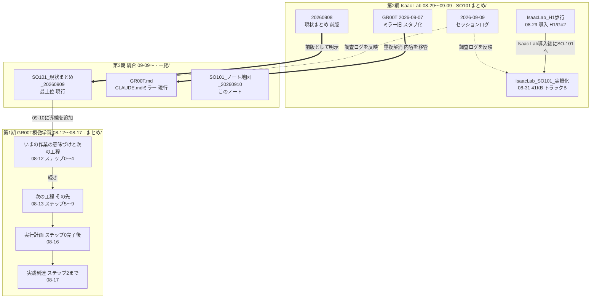
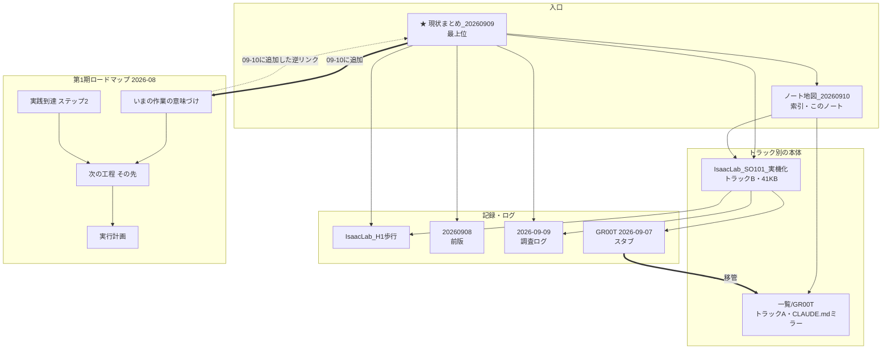

# SO-101 ノート地図（位置づけと新旧関係）

作成 2026-09-10 ／ 対象は `一覧/` `まとめ/` `SO101まとめ/` の **13ノート**

> **結論**：[[SO101_現状まとめ_20260909]] が現行の最上位。
> 2026-09-10 の整理で、最上位から**12ノート全てに到達可能**になった。

---

## 図1：版の系譜（新旧関係）



> [!note]- 画像版（PNG・Mermaidが描画されない環境用）
> ![[その他/SO101_ノート地図_図1_版の系譜_20260910.png]]

太い矢印（==>）が**置き換え**、点線が**マージ・反映**。

## 図2：参照の層構造

全リンクを描くと40本超が交差して読めないため、**骨格だけ**を示す。



> [!note]- 画像版（PNG・Mermaidが描画されない環境用）
> ![[その他/SO101_ノート地図_図2_参照の層構造_20260910.png]]

### 参照の集中度

| ノート                             |   出 |   入 |      計 |
| ------------------------------- | --: | --: | -----: |
| [[SO101_現状まとめ_20260909]]        |   9 |   8 | **17** |
| [[SO101_ノート地図_20260910]]        |  11 |   6 | **17** |
| [[SO101まとめ/IsaacLab_SO101_実機化]] |   6 |   7 | **13** |
| [[SO101まとめ/GR00T　2026-09-07]]   |   6 |   5 |     11 |
| [[まとめ/【まとめ】次の工程 その先]]           |   4 |   5 |      9 |
| [[SO101まとめ/2026-09-09]]         |   5 |   4 |      9 |
| [[まとめ/【まとめ】いまの作業の意味づけと次の工程]]    |   3 |   5 |      8 |
| [[SO101まとめ/IsaacLab_H1歩行]]      |   3 |   5 |      8 |
| [[まとめ/【実行計画】ステップ0完了後の具体作業]]     |   4 |   3 |      7 |
| [[SO101まとめ/20260908]]           |   2 |   5 |      7 |
| [[まとめ/【まとめ】実践到達 ステップ2まで]]       |   3 |   2 |      5 |
| [[一覧/GR00T]]                    |   1 |   2 |      3 |

**[[SO101まとめ/IsaacLab_SO101_実機化]] が実質的なハブ**（入7・出6）。
最上位より本文量が多く（41KB）、技術的な詳細はここに集約されている。

---

## 各ノートの位置づけ

| ノート | 日付 | 位置づけ | 状態 |
|---|---|---|---|
| [[SO101_現状まとめ_20260909]] | 09-09 | **最上位**。2トラックの全体像 | **現行** |
| [[SO101まとめ/IsaacLab_SO101_実機化]] | 08-31 | トラックB（強化学習）の全記録・41KB。**事実上のハブ** | 現行 |
| [[SO101まとめ/IsaacLab_H1歩行]] | 08-29 | Isaac Lab導入、H1/Go2歩行 | 現行 |
| [[SO101まとめ/2026-09-09]] | 09-06〜09 | 調査ログ。関連部分は他へマージ済み | 参照用 |
| [[一覧/GR00T]] | 09-09同期 | `CLAUDE.md` のミラー | **現行** |
| [[SO101まとめ/GR00T　2026-09-07]] | 09-07同期 | 重複ミラー。**09-10にスタブ化**（案内のみ） | 役目終了 |
| [[SO101まとめ/20260908]] | 09-08 | 現状まとめの**前版** | 旧版 |
| [[まとめ/【まとめ】いまの作業の意味づけと次の工程]] | 08-12 | ロードマップ ステップ0〜4 | 第1期 |
| [[まとめ/【まとめ】次の工程 その先]] | 08-13 | ロードマップ ステップ5〜9 | 第1期 |
| [[まとめ/【実行計画】ステップ0完了後の具体作業]] | 08-16 | ステップ0完了後の実作業 | 第1期 |
| [[まとめ/【まとめ】実践到達 ステップ2まで]] | 08-17 | 第1期の到達点 | 第1期 |
| [[SO101_ノート地図_20260910]] | 09-10 | このノート | 現行 |
| [[SO101まとめ/URDFとFK_20260910]] | 09-10 | URDFの読み方・FK・符号の実測方法 | 現行 |

---

## 構造上の問題（2026-09-10 に解消）

### ① 第1期（まとめ/）が孤島だった → 解消

`まとめ/` の4本へ入る外部リンクは [[SO101まとめ/IsaacLab_SO101_実機化]] からの1本だけ・片方向で、
最上位からは**到達できなかった**。8月のロードマップが現在の作業の前提でありながら、
辿れないため参照されなくなっていた。

**対応**：最上位に第1期ロードマップの一覧表を追加し、4本それぞれからも最上位への逆リンクを張った。
→ **最上位から12/12ノートに到達可能**。

### ② `CLAUDE.md` のミラーが2つあった → 解消

| | 最終同期 | 対応 |
|---|---|---|
| [[一覧/GR00T]] | 2026-09-09 | **現行として維持** |
| [[SO101まとめ/GR00T　2026-09-07]] | 2026-09-07 | 本文を削除し案内のみのスタブに |

照合時点で内容は完全一致（モデルパス12件すべて一致）しており、分岐は起きていなかった。
ただし両ノート自身が警告していた
「2ファイルが黙って分岐し、存在しないモデルパスが残って**サーバーが起動しない事故**」
の構成に戻っていたため、重複を解消した。

4ノートからリンクされているためファイルは残している（削除するとリンクが壊れる）。
バックアップ：`C:/Users/saito/Desktop/vault_backup_20260910/`

---

## グラフビューの絞り込み

グラフビュー右上の**検索欄**に貼る：

```
(path:まとめ OR path:GR00T OR path:ノート地図) -path:琵琶湖
```

これで **12ノートちょうど**に絞れる。

- `-path:琵琶湖` が無いと、ファイル名に「まとめ」を含む琵琶湖の3ノートが混入する
- `path:ノート地図` が無いと、このノート自身が漏れる
- `一覧/` の無関係な6本（スキル一覧、ゼミのTO DO 等）は自動的に除外される

さらに見やすくするには、グラフ設定で

- **孤立ノードを表示** → OFF
- **添付ファイルを表示** → OFF（既にOFF）
