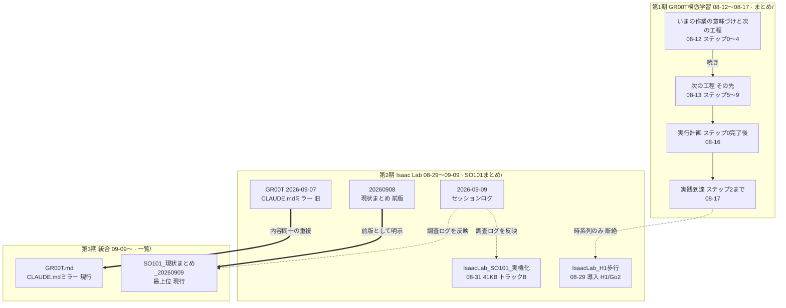
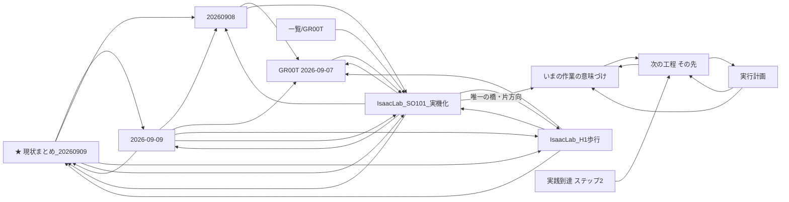

# SO-101 ノート地図（位置づけと新旧関係）

作成 2026-09-10 ／ 対象は `一覧/` `まとめ/` `SO101まとめ/` の **11ノート**

> **結論**：[[SO101_現状まとめ_20260909]] が現行の最上位。
> ただし**第1期（まとめ/）と第2期以降がほぼ断絶**しており、最上位から
> 8月のロードマップ4本へは**1本もリンクが無い**。

---

## 図1：版の系譜（新旧関係）



太い矢印（==>）が**置き換え**、点線が**明示リンクの無い関係**。

## 図2：実際の参照リンク



---

## 各ノートの位置づけ

| ノート | 日付 | 位置づけ | 状態 |
|---|---|---|---|
| [[SO101_現状まとめ_20260909]] | 09-09 | **最上位**。2トラックの全体像 | **現行** |
| [[SO101まとめ/IsaacLab_SO101_実機化]] | 08-31 | トラックB（強化学習）の全記録・41KB。**事実上のハブ** | 現行 |
| [[SO101まとめ/IsaacLab_H1歩行]] | 08-29 | Isaac Lab導入、H1/Go2歩行 | 現行 |
| [[SO101まとめ/2026-09-09]] | 09-06〜09 | 調査ログ。関連部分は他へマージ済み | 参照用 |
| [[一覧/GR00T]] | 09-10同期 | `CLAUDE.md` のミラー | **現行** |
| [[SO101まとめ/GR00T　2026-09-07]] | 09-07同期 | 同上の**重複**。内容は同一 | ⚠️ 重複 |
| [[SO101まとめ/20260908]] | 09-08 | 現状まとめの**前版** | 旧版 |
| [[まとめ/【まとめ】いまの作業の意味づけと次の工程]] | 08-12 | ロードマップ ステップ0〜4 | 第1期 |
| [[まとめ/【まとめ】次の工程 その先]] | 08-13 | ロードマップ ステップ5〜9 | 第1期 |
| [[まとめ/【実行計画】ステップ0完了後の具体作業]] | 08-16 | ステップ0完了後の実作業 | 第1期 |
| [[まとめ/【まとめ】実践到達 ステップ2まで]] | 08-17 | 第1期の到達点 | 第1期 |

---

## 見つかった構造上の問題

### ① 第1期（まとめ/）が事実上の孤島

`まとめ/` の4本へ入る外部リンクは **[[SO101まとめ/IsaacLab_SO101_実機化]] からの1本だけ**で、しかも片方向。
最上位の [[SO101_現状まとめ_20260909]] からは**到達できない**。

8月のロードマップ（ステップ0〜9）は現在の作業の前提になっているが、
**最上位から辿れないため参照されなくなっている**。

### ② `CLAUDE.md` のミラーが2つある

| | 最終同期 | 状態 |
|---|---|---|
| [[一覧/GR00T]] | 2026-09-09 | 現行 |
| [[SO101まとめ/GR00T　2026-09-07]] | 2026-09-07 | 重複 |

2026-09-10 時点で**内容は同一**（モデルパス12件すべて一致）。分岐は起きていない。
ただし両ノート自身が警告している通り、
「以前この2ファイルが黙って分岐し、両方に存在しないモデルパスが残って**サーバーが起動しない事故**」の再来リスクがある。

---

## グラフビューの絞り込み

グラフビュー右上の**検索欄**に貼る：

```
(path:まとめ OR path:GR00T) -path:琵琶湖
```

これで **11ノートちょうど**に絞れる。`一覧/` の無関係な6本（スキル一覧、ゼミのTO DO 等）と
琵琶湖3本が除外される。

さらに見やすくするには、グラフ設定で

- **孤立ノードを表示** → OFF
- **添付ファイルを表示** → OFF（既にOFF）
