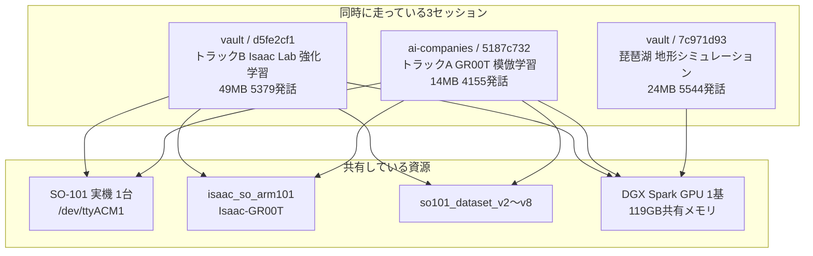
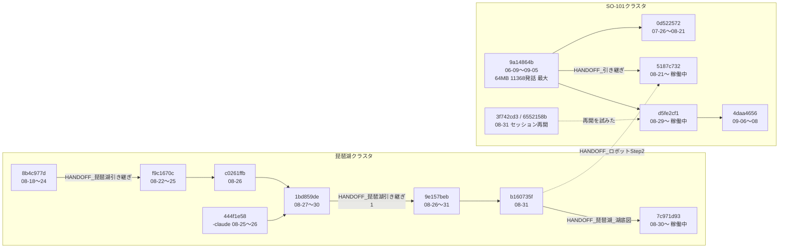

# 並行セッションの関係図

調査日 2026-09-11 ／ 対象は `~/.claude/projects/` の全トランスクリプト（33セッション・約300MB）

> **結論**：いま**3セッションが同時に走っている**。うち2つは
> **同じ実機・同じリポジトリ・同じGPUを共有**しており、構造的に干渉する。

---

## 1. いま生きているセッション

`.jsonl` の最終更新時刻で判定（数分以内に書き込みがあるもの）。

| 更新        | セッション      | プロジェクト                 |          規模 | 期間     | テーマ                          |
| --------- | ---------- | ---------------------- | ----------: | ------ | ---------------------------- |
| **19:52** | `d5fe2cf1` | vault                  | 49MB / 5379 | 08-29〜 | **トラックB**：Isaac Lab 強化学習の実機化 |
| **19:50** | `7c971d93` | vault                  | 24MB / 5544 | 08-30〜 | **琵琶湖**：地形シミュレーション           |
| **19:48** | `5187c732` | Downloads-ai-companies | 14MB / 4155 | 08-21〜 | **トラックA**：GR00T 模倣学習         |
| 09-10     | `e0387460` | Downloads              | 1.1MB / 621 | 09-08〜 | GR00T周辺（休止中）                 |



> [!note]- 画像版（PNG）
> ![[その他/並行セッション_図1_20260911.png]]

### 競合の根拠（参照回数）

| 資源                   | `d5fe2cf1`（トラックB） | `5187c732`（トラックA） |
| -------------------- | ----------------: | ----------------: |
| `isaac_so_arm101`    |               643 |               463 |
| `Isaac-GR00T`        |                 — |               252 |
| `so101_rl_deploy.py` |               352 |                 — |
| `so101_dataset_*`    |                 — |               244 |

**両方が同じリポジトリを大量に触っている。** これは
[[SO101_現状まとめ_20260909]] が冒頭で警告している
「両者は**実機を叩く定数を共有**しているため干渉する」の実体。

---

## 2. 危険な点

### ① 実機は1台しかない

`/dev/ttyACM1`（フォロワーアーム）は排他資源。
2セッションが同時に掴むと、**シリアル通信が混線**する。

> **2026-09-11 現在、アームはトラックB側の測定でトルクOFFのまま放置されている。**
> トラックA（`5187c732`）が `run_groot.py` を起動すると、
> **HOME復帰を経ずにいきなり動く**おそれがある。

### ② GPU も1基

`CLAUDE.md` に「**学習中はサーバーを落とすこと**（GPU OOM競合）」とあるが、
これは**セッション間の約束**であって、システムが強制するものではない。
琵琶湖セッションもGPUを使う。**3セッションすべてがGPUの潜在的競合相手**。

### ③ 定数が黙って書き換わる

`MOTOR_LIMITS` / `HOME_POSITION` / `SIGN` は
`so101_rl_deploy.py`（トラックB）と `run_groot.py`（トラックA）が別々に持っている。
片方を直してももう片方に反映されない。

> 幸い `run_groot.py` は `SIGN` も角度変換も使わず**raw値のまま**扱うため、
> 2026-09-10 に判明した `SIGN[1]`/`SIGN[4]` の誤りはトラックAに影響しない。
> → [[SO101まとめ/URDFとFK_20260910]]

---

## 3. セッションの系譜

セッションは**引き継ぎ文書（HANDOFF）**で繋がっている。
これが実質的な「セッション間のエッジ」。



> [!note]- 画像版（PNG）
> ![[その他/並行セッション_図2_20260911.png]]

### 引き継ぎ文書の一覧

| 文書 | 使ったセッション | 参照回数 |
|---|---|---:|
| `HANDOFF_琵琶湖引き継ぎ1.md` | 7c971d93, 1bd859de, 9e157beb, b160735f | 852 |
| `HANDOFF_琵琶湖_湖底図.md` | 7c971d93, 1bd859de, b160735f, f9c1670c, 444f1e58 | 528 |
| `HANDOFF_琵琶湖引き継ぎ.md` | 1bd859de, 444f1e58, 8b4c977d, 9e157beb, c0261ffb | 259 |
| `HANDOFF_引き継ぎ.md` | 9a14864b | 69 |
| `HANDOFF_ロボットStep2引き継ぎ.md` | 5187c732, b160735f | 3 |

**琵琶湖クラスタは引き継ぎ文書での接続が濃く、SO-101クラスタは薄い。**
SO-101側は引き継ぎ文書ではなく、**Vaultのノート**（[[SO101_現状まとめ_20260909]] 等）で
繋がっている。→ [[SO101_ノート地図_20260910]]

---

## 4. 2つのクラスタを跨いだセッション

| セッション | 内容 |
|---|---|
| `b160735f`（08-31「ほかの」） | 琵琶湖HANDOFF 57回 ＋ `isaac_so_arm101` 3回 ＋ ロボットStep2 2回 |
| `3f742cd3`（08-31「IsaacLabのセッションを再開したい」） | `so101_rl_deploy.py` 22回 ＋ 琵琶湖HANDOFF 4回 |
| `8b4c977d`（08-18「kit XAE わかりますか」） | 琵琶湖HANDOFF 74回 ＋ `Isaac-GR00T` 4回 |

**8月末に「どのセッションで何をやっていたか」を見失い、探し回った跡**が読み取れる。
`3f742cd3` と `6552158b` はどちらも「IsaacLabのセッションを再開したい」で始まり、
**同じ日に2回、同じことを試している**。

---

## 5. 運用上の提案

| # | 提案 | 理由 |
|---|---|---|
| 1 | **実機を使う前に他セッションの状態を確認** | `/dev/ttyACM1` は排他。混線すると原因究明が困難 |
| 2 | **アームは使用後に必ずHOMEへ戻す** | 次に触るセッションが前提を置けない。今まさにトルクOFFで放置中 |
| 3 | **定数は1か所に集約** | `MOTOR_LIMITS` 等が2ファイルに重複。片方だけ直す事故が起きる |
| 4 | **セッションの役割を固定** | トラックA＝`5187c732`、トラックB＝`d5fe2cf1`、琵琶湖＝`7c971d93` |
| 5 | **GPUを使う前に `nvidia-smi`** | 3セッションすべてがGPU競合の相手 |

### 調べ方（再現手順）

```bash
# 生きているセッションを探す
find ~/.claude/projects -name "*.jsonl" -newermt "2 hours ago" \
  -printf "%TY-%Tm-%Td %TH:%TM  %10s  %p\n" | sort -r

# 各セッションが触っているファイル
grep -o 'HANDOFF_[^"]*\.md' ~/.claude/projects/*/SESSION.jsonl | sort | uniq -c | sort -rn
```

Claude Code 内からは `ListAgents` でも生きているセッションを列挙できる
（ただし表示名 `vault-9c` 等は `.jsonl` のUUIDと直接は対応しない）。

## 関連ノート

| ノート | 内容 |
|---|---|
| [[SO101_現状まとめ_20260909]] | 最上位。2トラックの全体像と干渉の警告 |
| [[SO101_ノート地図_20260910]] | ノート間の位置づけと新旧関係 |
| [[SO101まとめ/URDFとFK_20260910]] | トラックB固有の技術調査 |
| [[SO101まとめ/IsaacLab_SO101_実機化]] | トラックBの全記録 |
